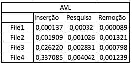
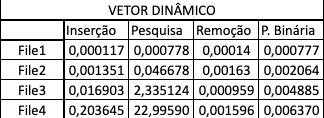
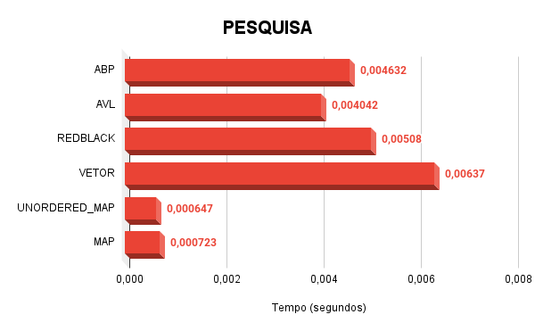

# Comparação de Estruturas de Dados 

## 1 - Introdução

**Árvores de Pesquisa Binária (APB)**, Árvores Binárias balanceadas **AVL** e **Red-Black**, **Vetores Dinâmicos** - *vector* em C++ - e **Tabela Hash** - *unordered_map* e *map* em C++ - são as estruturas que foram comparadas neste repósitorio. Nos tópicos a seguir, será discutido brevemente o que são estas estruturas e o porquê de compará-las entre si, além de apresentar os resultados obtidos e discuti-los.

## 2 - Apresentação e objetivo

Por meio de 4 arquivos de entrada, *File1.txt*, *File2.txt*, *File3.txt* e *File4.txt* com respectivamente, 500 (Quinhentos), 5.000 (Cinco Mil), 50.000 (Cinquenta Mil) e 500.000 (Quinhentos Mil) números decimais que variam de `00000.00000` até `99999.99999`. Cada **Estrutura de Dados (ED)** citada no tópico anterior, foi implementada 4 vezes, a mesma  **ED** para cada arquivo. Ou seja, 4 **APB's**, 4 **AVL's**, 4 **Red-Black's**, 4 **Vetores**, 8 **Tabelas Hash** - ***4 unodered_map's e 4 map's***. Totalizando 24 estruturas criadas por meio da *inserção*.

Após a criação de cada estrutura tem-se o arquivo *search.txt* com 10.000 (Dez Mil) números decimais. Este arquivo foi criado copiando de forma aleatória e embaralhando números presentes nos 4 arquivos iniciais de entrada. O arquivo *search.txt*  é utilizado para *pesquisa* em cada uma das estruturas criadas.

Fazendo cada um dos procedimentos descritos nos parágrafos acima para cada uma das **ED's** criadas, entra a parte de remoção. Utilizando o mesmo arquivo para a pesquisa, os elementos que estiverem presente na pesquisa são removidos.

O objetivo é executar cada uma das etapas, *inserção*, *pesquisa* e *remoção*, calcular seus tempos de forma independente para cada uma das estruturas e assim, análisar, apresentar seus resultados.

## 3 - Metodologia

Os tempos das etapas são computados por meio da biblioteca **`chronos`**. Como exemplo geral, nos parágrafos abaixo será monstrado passo-a-passo a medição de tempo para todas as etapas da estrutura de **APB**. Além disso, também será evidenciado alguns casos especiais que diferem do formato geral.

Por meio da função **`InsertNumbersInBTree(Btree **root, string name_arq)`** é feita a inserção na árvore. O primeiro parâmetro é o endereço da raiz da árvore, o segundo é o nome do arquivo com a sua extensão. É por meio do segundo parâmetro que a função sabe qual arquivo será lido como entrada para a estrutura - Exemplo: ***InsertNumbersInBTree(&root, "File1.txt")*** . A medição do tempo é feita a cada *inserção* na árvore e somado para obter o tempo total de *inserção* referente ao arquivo.

As etapas de *pesquisa* e *remoção* é feita pela função  **`SearchAndRemoveNumbersInBTree(BTree_Tree **root)`** - Exemplo: ***SearchAndRemoveNumbersInBTree(&root)*** , tendo como parâmetro apenas o endereço da raiz da árvore. No caso desta função, ao passar a raiz da árvore, é feita a leitura do arquivo *search.txt* e ao ler cada uma das entradas do arquivo, é realizada a *pesquisa*. Caso a pesquisa encontre o elemento que se está procurando, então é feita a remoção deste elemento da árvore. O tempo de *pesquisa* e *remoção* são calculados de forma idependente, da mesma forma que na inserção. A cada *pesquisa* e a cada provável *remoção* é feita a contabilização do tempo e é somado a cada nova entrada do arquivo *search.txt* para obter o tempo total para a *pesquisa* e para as possíveis remoções.

Para conseguir fazer uma média com o tempo de cada etapa, foi implementada a função **`MakeBTree()`**. Nela são criados 4 loops, que rodam 10 vezes cada - para que seja possível calcular uma média e um desvio-padrão -, e em cada loop é feita uma estrutura de **APB**. Uma árvore é criada em cada loop para cada arquivo, diferente - 4 loops para 4 arquivos. Chamando as funções criadas a cima para obter o tempo de *insercão*, *pesquisa* e *remoção* em cada loop. A figura 1 abaixo, evidencia como isso foi feito em código.

Figura 1 - Código de Função **`MakeBTree()`**

De forma análoga ao explicado nos parágrafos anteriores, todas as **ED's** se baseiam neste formato de 3 funções para as etapas a serem executadas. Com a execessão do **Vetor(vector)** - que não é uma **ED**, mas sim, um **Vetor Dinâmico** -, cujo na função de *inserção*, o tempo é calculado juntamente com a **Ordenação** do vetor. Além disso, na função de *pesquisa* e *remoção* é tabém obtido o tempo de **Pesquisa Binária** no vetor. Na figura 2 a seguir, mostra o arquivo cabeçalho do código para melhor entendimento.

Figura 2 - Arquivo cabeçalho (Funções de Implementação).

## 4 - Resultados

Por meio das próximas tabelas nas figuras abaixo, é possível analisar a difereça de tempo de cada estrutura. Cada estrutura foi executada 10 vezes para se calcular o tempo de cada etapa e assim, fazer média. As figuras abaixo mostram a média em "segundos" de cada etapa para cada estrutura com seus respectivos arquivos de entrada. Todos os resultados foram obtidos em um **`Macbook Pro`**, modelo **`A2338`** com processador **`AppleSilicon M1`** de **`8GB`** de memória RAM e **`512GB`** de disco.

 Figura 3 - Média de tempos da **Árvore de Pesquisa Binária**

 Figura 4 - Média de tempos da **Árvore Binária AVL**

 Figura 5 - Média de tempos da **Árvore Binária RED-BLACK**

 Figura 6 - Média de tempos do **Vetor Dinâmico**

 Figura 7 - Média de tempos da **Tabela Hash**

 Figura 8 - Média de tempos do **Map**

Para que seja possível discutir estes resultados, presentes nas tabelas das figuras acima, é necessário primeiro esclarecer que a estrutura ***map*** em C++ encontrada na biblioteca *<map>* na verdade não é uma **Tabela Hash**. O **map** atua como uma HASH entretanto, de forma enrustida no código da biblioteca, tem-se que o **map** é na verdade uma **Árvore Binária RED-BLACK** otimizada, visto que é uma biblioteca padrão do C++. Além do fator anterior é importante ressaltar que a "massa de dados" interfere diretamente no tempo de cada uma das etapas.

Por meio dos dados acima é possível provar que os dados afetam o tempo em cada uma das etapas nas três árvores e no **Vetor Dinâmico**. No caso das estrturas em árvore, quanto maior a massa de dados, "mais profunda" a estrtura fica, consequentemente, fica cada vez maior o tempo para caminhar pela árvore. No caso do vetor, para compará-lo com as demais estruturas é necessário ordena-lo, e a partir de uma certa quantidade de elementos, o tempo de ordenação aumenta conforme a massa de dados cresce.

Ao fazer a comparação de tempo das tabelas das três **Árvores Binárias**, é possível comprovar que ambas as estruturas estão praticamente identicas aos tempos de cada etapa. Com desvios-padrões pequenos. A figura 9 abaixo apresenta o desvio-padrão de cada etapa referente, a cada arquivo, de forma análoga as tabelas mostradas nas figuras anteriores.

 Figura 9 - Desvio-Padrão das **Árvores Binárias** referente as etapas em cada arquivo de entrada.

Com relação ao **Vetor Dinâmico** tem-se uma discrepância no desvio-padrão da pesquisa sequencial padrão, pois, quanto maior o tamanho do vetor, maior será o tempo que ele levará para fazer uma pesquisa sequencial. Por isso, nos gráficos abaixo, o tempo de **Pesquisa Binária** foi o utilizado para comparar com as demais estruturas. Também, como foi mostrado,que "massa de dados" influência  diretamente no tempo das etapas, os gráficos mostram as etapas de *inserção*, *pesquisa* e *remoção* de cada **ED** construídas a partir do arquivo *"File4"* que possui a maior quantidade de entradas.

 Figura 10 - Etapa de *inserção* em cada uma das estruturas para 500.000 entradas.

 Figura 10 - Etapa de *pesquisa* em cada uma das estruturas.

 Figura 10 - Etapa de *remoção* em cada uma das estruturas.

## 5 - Conclusão

Dessa forma, conforme o que foi apresentado, pode-se concluir o melhor desempenho das estruturas **`unordered_map`** e **`map`**. Entretanto, é importante ressaltar alguns pontos. Primeiro, "qual o tamanho da massa de dados?", "como estes dados estão estruturados?". Estas duas perguntas devem ser feitas, pois, se a massa de dados é substancialmente grande, pensar em memória é importante. - Para o arquivo com 500.000 entradas, por exemplo, tanto as **Árvores Binárias**, quanto o **Vetor Dinâmico** e as **Tabelas Hash** irão utilizar de Swap e/ou memória secundária. Com relação a segunda pergunta, conhecer sobre como os dados estão distribuídos, se estão ou não ordenados, se há grande quantidade de repetições, influência - Como exemplo, quanto menor a quantidade de números repetidos, "mais profunda" será a árvore binária e neste caso já devemos olhar a primeira pergunta novamente.

O segundo ponto que é importante ressaltar é que, todas as estruturas podem atender a inúmeros casos, mas nem todas as estruturas irão "performar" tão bem. Como é o caso da **Árvore Binária RED-BLACK**, que ao se comparar com a estrutura **`map`** - que é a mesma estrutura de uma "RED-BLACK" -, possui um desempenho muito inferior ao **`map`** - Isto, de acordo com os resultados apresentados.

O terceiro e ultimo ponto é o hardware. Memória é um recurso finito e por isso, deve se procurar utilizar a melhor estrutura possível para cada caso. "Menos tempo, menor gasto de energia".

## 6 - Referências

CORMEN, Thomas H. et al. Introduction to algorithms. MIT press, 2022.

Ziviani, Nívio. Projetos de Algoritmos com Implementação em Pascal e C; 2022.

Implementação da Árvore Binária RED-BLACK: Allen, zhaozhencn. [repository link]: https://github.com/zhaozhencn/rbtree.

Documentação de C++: [site link]: https://cplusplus.com

## 7 - Compilação e Execução

Utilize os comandos conforme suas funcões para compilar e executar

| Comando                |  Função                                                                                           |                     
| -----------------------| ------------------------------------------------------------------------------------------------- |
|  `make clean`          | Apaga a última compilação realizada contida na pasta build                                        |
|  `make`                | Executa a compilação do programa utilizando o gcc, e o resultado vai para a pasta build           |
|  `make run`            | Executa o programa da pasta build após a realização da compilação                                 |

